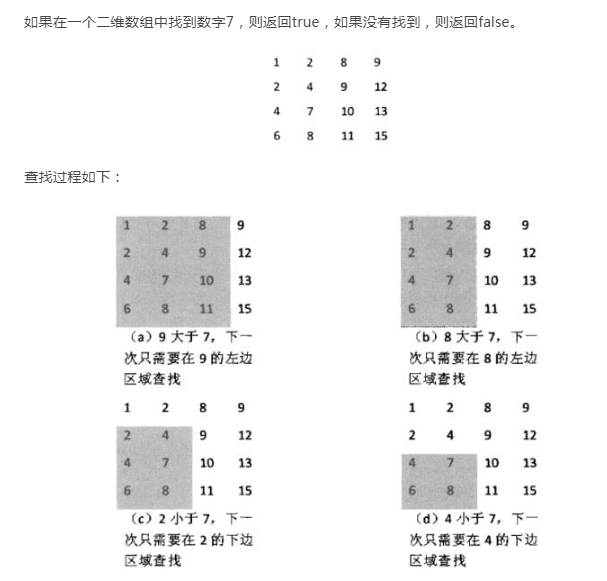

# 题目
题目描述
在一个二维数组中（每个一维数组的长度相同），每一行都按照从左到右递增的顺序排序，每一列都按照从上到下递增的顺序排序。请完成一个函数，输入这样的一个二维数组和一个整数，判断数组中是否含有该整数。

# 思路



# 代码实现

因为牛客网可以使用php7.1，因此用php来实现

```bash
    <?php
    
    function Find($target, $array)
    {
        //行的长度
       $rows = count($array);
        //列的长度
       $cols = count($array[0]);
       
        
       if($rows>0 && $cols>0){
           $row = 0;
           $col = $cols-1;
        
           while($row<$rows && $col>=0){
               if($target==$array[$row][$col]){
                   return true;
               }else if($target<$array[$row][$col]){
                   $col -=1;
               }else{
                   $row +=1;
               }
           }
       }
       return false;
    }
```